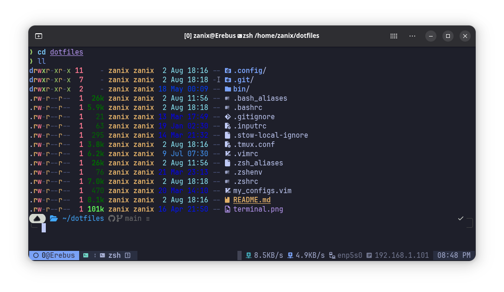

# dotfiles

This repository contains my personal configuration files and scripts for optimizing my development environment. Includes settings for Zsh, Tmux, Vim, and more.



## Software

### Shell (Linux)

- ZSH
- [Zinit](https://github.com/zdharma-continuum/zinit) - Flexible and fast ZSH plugin manager
- [Oh My Posh](https://ohmyposh.dev) - A prompt theme engine for any shell
- [Nerd Fonts](https://www.nerdfonts.com) - Patched fonts with glyphs (icons)
- [fzf](https://github.com/junegunn/fzf) - Interactive filtering

### Tmux

- Tmux >= **1.9**
- [Tmux plugin manager](https://github.com/tmux-plugins/tpm) - Installs and loads `tmux` plugins
- [tmux-powerline](https://github.com/erikw/tmux-powerline) - Status bar consisting of dynamic & beautiful looking powerline segments, written purely in bash

### Neovim

- Neovim >= **0.9.0** (needs to be built with **LuaJIT**)
- Git >= **2.19.0**
- [LazyVim](https://www.lazyvim.org)
- a **C** compiler for `nvim-treesitter`. See [here](https://github.com/nvim-treesitter/nvim-treesitter#requirements)
- for [telescope.nvim](https://github.com/nvim-telescope/telescope.nvim) **_(optional)_**
  - **find files**: [fd](https://github.com/sharkdp/fd)
- a terminal that supports true color and _undercurl_: (I use ghostty)
  - [ghostty](https://github.com/ghostty-org/ghostty) **_(Linux & MacOS)_**
    - [config tool](https://ghostty.zerebos.com)
  - [kitty](https://github.com/kovidgoyal/kitty) **_(Linux & MacOS)_**
  - [wezterm](https://github.com/wez/wezterm) **_(Linux, MacOS & Windows)_**
  - [alacritty](https://github.com/alacritty/alacritty) **_(Linux, MacOS & Windows)_**
  - [iterm2](https://iterm2.com) **_(MacOS)_**

### Vim

> [!NOTE]
> I use this for systems where I haven't updated to Neovim yet

I use the [Ultimate Vim Configuration](https://github.com/amix/vimrc) for a quick and decent setup

> [!IMPORTANT]
> I use the [Install for multiple users](https://github.com/amix/vimrc#install-for-multiple-users) option

After setting this up, it automatically places a `.vimrc` file into my profile. Then I copy my custom config into the `vim_runtime` directory.

```shell
sudo cp ~/dotfiles/my_configs.vim /opt/vim_runtime/
```

### Others

- [bat](https://github.com/sharkdp/bat) - A cat(1) clone with wings
- [Btop](https://github.com/aristocratos/btop) - A monitor of resources
- [eza](https://github.com/eza-community/eza) - A modern alternative to ls
- [Fastfetch](https://github.com/fastfetch-cli/fastfetch) - A maintained, feature-rich and performance oriented, neofetch like system information tool
- [Lazygit](https://github.com/jesseduffield/lazygit) - A simple terminal UI for git commands

## Requirements

Install dependencies on your system.

### Arch

```shell
sudo pacman -Sy fd fzf git neovim stow yq zsh
```

Install `ifstat` and `oh-my-posh` from the AUR

```shell
yay ifstat oh-my-posh-bin
```

#### Optional Arch packages

```shell
sudo pacman -Sy bat btop eza fastfetch lazygit
```

### Ubuntu/Debian

> [!WARNING]
> The default behavior for Zsh in Ubuntu is to initialize `compinit` for every session.
> This causes the prompt to load very slowly unless it is disabled.
> The `.zshenv` file with the `skip_global_compinit=1` fixes this.

```shell
sudo apt install fd-find fzf git ifstat neovim python3-venv stow zsh
```

`yq` needs to be installed via snap or ppa

```shell
snap install yq --channel=v3/stable
```

```shell
sudo add-apt-repository ppa:rmescandon/yq
sudo apt update
sudo apt install yq -y
```

Install `oh-my-posh` globally using the official install script

```shell
curl -s https://ohmyposh.dev/install.sh | sudo bash -s -- -d /usr/local/bin
```

#### Optional Ubuntu packages

```shell
sudo apt install bat btop
```

`btop` needs to be installed via snap on Ubuntu 22.04 and older

```shell
sudo snap install btop
```

`eza` needs to be installed via ppa

```shell
sudo mkdir -p /etc/apt/keyrings
wget -qO- https://raw.githubusercontent.com/eza-community/eza/main/deb.asc | sudo gpg --dearmor -o /etc/apt/keyrings/gierens.gpg
echo "deb [signed-by=/etc/apt/keyrings/gierens.gpg] http://deb.gierens.de stable main" | sudo tee /etc/apt/sources.list.d/gierens.list
sudo chmod 644 /etc/apt/keyrings/gierens.gpg /etc/apt/sources.list.d/gierens.list
sudo apt update
sudo apt install -y eza
```

`fastfetch` needs to be installed via ppa

```shell
add-apt-repository -y ppa:zhangsongcui3371/fastfetch
```

```shell
sudo apt install fastfetch
```

`lazygit` needs to be installed manually

```shell
LAZYGIT_VERSION=$(curl -s "https://api.github.com/repos/jesseduffield/lazygit/releases/latest" | \grep -Po '"tag_name": *"v\K[^"]*')
curl -Lo lazygit.tar.gz "https://github.com/jesseduffield/lazygit/releases/download/v${LAZYGIT_VERSION}/lazygit_${LAZYGIT_VERSION}_Linux_x86_64.tar.gz"
tar xf lazygit.tar.gz lazygit
sudo install lazygit -D -t /usr/local/bin/
```

### Other Software

#### Node Version Manager

Node Version Manager - POSIX-compliant bash script to manage multiple active node.js versions

> [!IMPORTANT]
> Node is required for Mason in Nvim, and NVM is how I install Node

```shell
curl -o- https://raw.githubusercontent.com/nvm-sh/nvm/v0.40.2/install.sh | bash
```

Install default version of node

```shell
nvm install node
```

## Installation

Clone this repository.

```shell
git clone https://github.com/zanix/dotfiles.git
```

Once cloned, navigate to the desired directory.

```shell
cd dotfiles
```

Run `stow` to install the dotfiles.

```shell
stow .
```

Dotfiles are now ready to use.

## Inspiration

I used these dotfile repos as a start to create my own.

- [dreamsofcode-io](https://github.com/dreamsofcode-io/dotfiles)
- [codeopshq](https://github.com/codeopshq/dotfiles)
- [craftzdog](https://github.com/craftzdog/dotfiles-public)

## Contributing

If you have any suggestions or find any bugs, please open an issue or pull request on GitHub.
